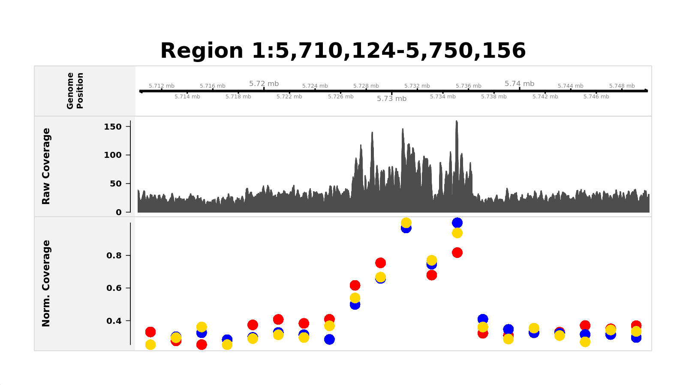
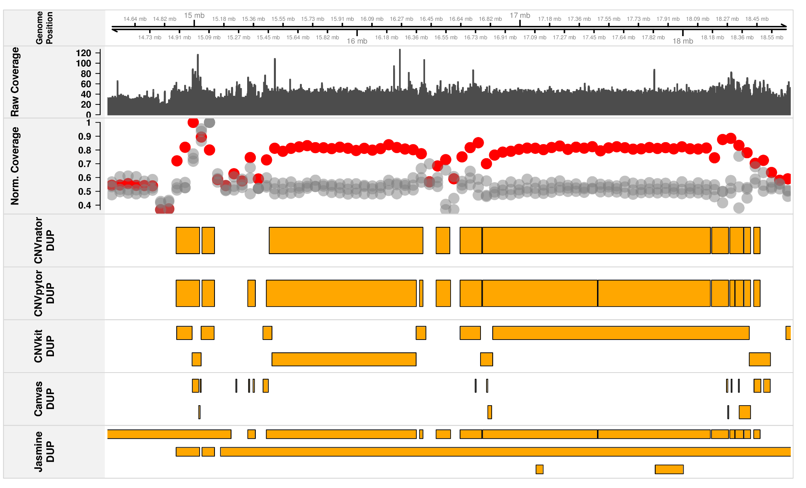

# GeGraphs 🧬

[](https://www.r-project.org/)
[](https://github.com/dea-ll/GeGraphs/releases/tag/v0.2.9)
[](https://github.com/dea-ll/GeGraphs)
[](https://github.com/dea-ll/GeGraphs/releases/tag/v0.2.9)

**GeGraphs is an R package for gene-centric visualization and structural variant exploration.**

GeGraphs was developed to facilitate the visual inspection and exploration of structural variants (SVs) by combining **GENCODE gene annotations**, **BAM sequencing coverage**, and **SV calls from BED or VCF files** within a single framework.

The package was developed during my Master's project in **Bioinformatics and Data Analysis in Biology (BIADB) at the University of Geneva (UNIGE)**.

> **Version:** 0.2.9  
> **Package type:** R package  
> **Status:** research and development  
> GeGraphs is intended to support structural variant exploration and manual review. It is not a standalone clinically validated diagnostic tool.

---

## Overview

Structural variant interpretation often requires several types of information to be inspected separately. GeGraphs brings these sources together in a single visualization framework:

- 🧬 **GENCODE gene annotations**
- 📈 **raw and normalized BAM coverage**
- 🧩 **structural variant calls from BED or VCF files**
- 👥 **optional control or family-member BAM files**
- 🧪 **multiple SV callers displayed together**
- 📋 **gene and panel-based SV exploration**

```text
                 GENCODE annotations
                         │
                         ▼
BAM coverage ───────► GeGraphs ◄─────── BED / VCF
                         │
              ┌──────────┼──────────┐
              ▼          ▼          ▼
         plot_gene()  plot_region()  SV/gene exploration
```

GeGraphs is designed as a **visualization and exploration layer following structural variant detection**.

---

## Main functions

| Function | Purpose |
|---|---|
| `plot_gene()` | Visualize a selected gene together with coverage and structural variant tracks |
| `plot_region()` | Visualize an arbitrary genomic interval |
| `get_genes_under_sv()` | Identify genes overlapped by structural variants |
| `get_gene_context()` | Explore genomic context around structural variants |
| `get_gene_context_for_gene()` | Retrieve neighbouring genes around a selected gene |
| `panels_overlap_df()` | Intersect a gene panel with SV calls and optionally generate gene-centred plots |

---

## 🖼️ Example outputs

### Figure 1 – Example of a gene-centred visualization with `plot_gene()`

This example shows how GeGraphs can be used for trio analysis by displaying the normalized BAM coverage of the proband, mother and father in distinct colours. This facilitates direct comparison between family members and helps visually assess the segregation of a candidate structural variant.



### Figure 2 – Example of structural variant caller comparison

This example displays structural variant tracks from multiple callers together with coverage information, allowing their predictions to be compared within the same genomic context.



---

## 📦 Installation

GeGraphs is distributed as an **R source package**.

### Download GeGraphs v0.2.9

The complete packaged source archive is available from the GitHub Release page:

👉 **[Download GeGraphs v0.2.9](https://github.com/dea-ll/GeGraphs/releases/tag/v0.2.9)**

The release contains:

```text
GeGraphs_0.2.9.tar.gz
```

This archive contains the complete R package, including its source code, documentation and the genomic annotation resources required by GeGraphs.

Install it from a terminal with:

```bash
R CMD INSTALL GeGraphs_0.2.9.tar.gz
```

Then load the package in R:

```r
library(GeGraphs)
packageVersion("GeGraphs")
```

Expected version:

```text
[1] '0.2.9'
```

If the unpacked package source is available locally, it can also be installed with:

```r
devtools::install("/path/to/GeGraphs")
```

---

## 🧬 Embedded genomic annotation resources

The complete GeGraphs R package contains genomic annotation resources under:

```text
inst/extdata/
```

These include:

```text
gencode.v47.basic.annotation.gff3.gz
gencode.v49lift37.basic.annotation.gff3.gz
mane_select_minimal_with_hgnc.tsv
```

These resources support the gene annotation and transcript-selection components used by GeGraphs.

Because the files are relatively large, they are **not duplicated directly in the visible GitHub repository**.

They are included in the complete packaged source archive:

👉 **[GeGraphs v0.2.9 Release](https://github.com/dea-ll/GeGraphs/releases/tag/v0.2.9)**

Therefore, users installing:

```text
GeGraphs_0.2.9.tar.gz
```

receive the annotation resources together with the R package.

Additional information is available in:

[`inst/extdata/README.md`](inst/extdata/README.md)

---

## ♻️ Reproducible environment

The Conda environment used during development is provided in:

```text
environment/dev_gegraphs_env.yml
```

It can be recreated with:

```bash
conda env create -f environment/dev_gegraphs_env.yml
conda activate dev_gegraphs_env
```

The main R/Bioconductor dependencies include packages for genomic ranges, BAM processing and genomic visualization, such as:

- `GenomicRanges`
- `IRanges`
- `Rsamtools`
- `rtracklayer`
- `Gviz`
- `S4Vectors`

---

## 📂 Input data

For a typical analysis, GeGraphs can use:

```text
sample.bam
sample.bam.bai

control_1.bam          # optional
control_1.bam.bai

control_2.bam          # optional
control_2.bam.bai

sample.delly.vcf       # optional
sample.dysgu.vcf       # optional
sample.cnvpytor.bed    # optional
```

The main visualization functions accept:

- one BAM file for the sample of interest;
- its corresponding BAM index;
- optional BAM files for controls or family members;
- optional BED or VCF files containing structural variant calls.

BAM files must be indexed before use.

---

## 🔎 `plot_gene()`

`plot_gene()` creates a multi-track visualization centred on a selected gene.

A figure can contain:

1. genomic coordinates;
2. gene annotation;
3. raw sequencing coverage;
4. normalized coverage;
5. one or more structural variant tracks.

### Minimal example

```r
library(GeGraphs)

sample_bam <- "path/to/sample.bam"

plot_gene(
  gene = "ERGIC1",
  bam_file = sample_bam,
  genome = "hg19",
  out = "ERGIC1_plot.pdf"
)
```

### With controls and SV calls

```r
control_bams <- c(
  Control_1 = "path/to/control_1.bam",
  Control_2 = "path/to/control_2.bam"
)

sv_files <- list(
  Delly = "path/to/sample.delly.vcf",
  Dysgu = "path/to/sample.dysgu.vcf"
)

plot_gene(
  gene = "ERGIC1",
  bam_file = sample_bam,
  control_bams = control_bams,
  vcf_list = sv_files,
  genome = "hg19",
  flank = 5000,
  show_gene = TRUE,
  show_cov = TRUE,
  show_sv = TRUE,
  bin_size = 2000,
  title = "ERGIC1 - coverage and structural variants",
  out = "ERGIC1_full.pdf"
)
```

---

## 🗺️ `plot_region()`

`plot_region()` uses the same visualization framework as `plot_gene()`, but the region is specified directly using genomic coordinates.

This is useful when:

- an SV extends beyond a single gene;
- several neighbouring genes need to be inspected;
- the region is intergenic;
- a broader copy-number pattern needs to be visualized.

```r
plot_region(
  chrom = "5",
  start = 172260000,
  end = 172360000,
  bam_file = sample_bam,
  control_bams = control_bams,
  vcf_list = sv_files,
  genome = "hg19",
  show_cov = TRUE,
  show_sv = TRUE,
  bin_size = 5000,
  title = "Chromosome 5 region",
  out = "chr5_region.pdf"
)
```

---

## 📊 Coverage visualization

GeGraphs displays both **raw** and **normalized** sequencing coverage.

- **Raw coverage** represents local read depth across the selected locus.
- **Normalized coverage** is summarized in genomic bins and facilitates comparison between the sample of interest and controls.

The `bin_size` argument controls the resolution:

- smaller bins provide finer local resolution;
- larger bins smooth local variation and are useful for broad genomic regions.

The most suitable value depends on the region size, sequencing depth and event being inspected.

---

## 🧬 Exploring genes affected by structural variants

### `get_genes_under_sv()`

This function identifies genes whose genomic coordinates overlap structural variants contained in a BED or VCF file.

```r
genes_under <- get_genes_under_sv(
  bed_file = "path/to/sample.filtered_DEL.bed",
  genome = "hg19"
)

head(genes_under)
```

---

## 🧭 Exploring gene context

Neighbouring genes can be explored using `get_gene_context()` or `get_gene_context_for_gene()`.

```r
context <- get_gene_context_for_gene(
  gene = "ERGIC1",
  genome = "hg19",
  n_upstream = 2,
  n_downstream = 2
)

context
```

This can be useful when an SV affects more than one gene or when neighbouring genes may also be relevant.

---

## 🧪 Panel-based SV analysis

`panels_overlap_df()` intersects structural variant calls with a predefined gene panel.

It can:

- return panel genes overlapped by SVs;
- optionally generate a `plot_gene()` figure for each overlapping gene.

```r
panel_df <- read.delim(
  "path/to/gene_panel.tsv",
  stringsAsFactors = FALSE
)

panel_hits <- panels_overlap_df(
  paneldf = panel_df,
  genecol = "GeneSymbol",
  bedfile = "path/to/sample.filtered_DEL.bed",
  vcffile = NULL,
  svtype = "DEL",
  genome = "hg19",
  makeplots = FALSE
)

head(panel_hits)
```

Automatic plotting can be activated with:

```r
makeplots = TRUE
```

---

## 📘 Documentation

The complete tutorial for **GeGraphs v0.2.9** is available here:

👉 **[GeGraphs v0.2.9 Tutorial](docs/tutorial/GeGraphs_v0.2.9_Tutorial.pdf)**

The tutorial includes:

- package installation;
- main dependencies;
- input data;
- `plot_gene()`;
- `plot_region()`;
- interpretation of GeGraphs outputs;
- coverage bin-size selection;
- genes affected by SVs;
- gene-context exploration;
- panel-based SV analysis;
- a complete example workflow;
- troubleshooting;
- session information.

---

## 🗂️ Repository organization

```text
GeGraphs/
│
├── README.md
├── DESCRIPTION
├── NAMESPACE
│
├── R/
│   └── R package source files
│
├── man/
│   └── R package documentation (.Rd)
│
├── environment/
│   └── dev_gegraphs_env.yml
│
├── docs/
│   ├── images/
│   │   ├── trio_example.png
│   │   └── tools_example.png
│   │
│   └── tutorial/
│       └── GeGraphs_v0.2.9_Tutorial.pdf
│
└── inst/
    └── extdata/
        └── README.md
```

This follows the standard organization of an **R package**:

- `DESCRIPTION` contains package metadata and dependencies;
- `NAMESPACE` defines exported functions and imports;
- `R/` contains the package source code;
- `man/` contains the `.Rd` function documentation;
- `inst/extdata/` contains package resources in the complete release;
- `environment/` records the development software environment;
- `docs/` contains user-facing documentation and example figures.

---

## 🔄 Typical workflow

```text
Structural variant detection
             │
             ▼
         BED / VCF
             │
             ▼
   Identify candidate region
             │
             ▼
          GeGraphs
             │
       ┌─────┴─────┐
       ▼           ▼
   plot_gene()  plot_region()
       │           │
       └─────┬─────┘
             ▼
Coverage + annotations + SV tracks
             │
             ▼
       Manual review
```

---

## ✅ Good practices

When using GeGraphs:

- BAM files must have an associated index;
- the selected genome build must match the input data;
- `bin_size` should be adapted to the size of the inspected region;
- very large BED or VCF files may benefit from preprocessing or region-based filtering;
- non-standard contigs are removed when preparing genomic ranges;
- MANE transcript information is prioritized when compatible with the available GENCODE annotation.

---

## ⚠️ Scope and limitations

GeGraphs provides a compact framework for combining genomic annotation, sequencing coverage and structural variant calls.

It can support:

- gene-level inspection of candidate SVs;
- comparison of coverage between a sample and controls;
- visualization of calls from multiple SV callers;
- exploration of genes within or around an SV;
- intersection of SV calls with gene panels;
- generation of targeted figures for manual review.

The visualization is intended to **support interpretation**, not replace variant validation or clinical assessment.

---

## 🔒 Data confidentiality

No patient-derived sequencing data are distributed with this repository.

The repository does not contain patient BAM/CRAM/FASTQ files, patient-derived SV files, clinical information, patient identifiers, credentials or internal infrastructure information.

The GENCODE and MANE resources bundled with the complete R package are **reference annotation resources and are not patient-derived data**.

---

## 🚀 Release

### GeGraphs v0.2.9

The complete packaged R source is available here:

👉 **[GitHub Release — GeGraphs v0.2.9](https://github.com/dea-ll/GeGraphs/releases/tag/v0.2.9)**

Download:

```text
GeGraphs_0.2.9.tar.gz
```

The archive contains the complete GeGraphs R package, including the resources stored under `inst/extdata/`.

Install with:

```bash
R CMD INSTALL GeGraphs_0.2.9.tar.gz
```

---

## 📝 Citation

If you use GeGraphs, please cite:

> Llugiqi, D. (2026). *GeGraphs: Gene-Centric Genomic Visualization Tools*. R package version 0.2.9.

---

## 👩‍💻 Author

**Dea Llugiqi**  
Master in Bioinformatics and Data Analysis in Biology (BIADB)  
University of Geneva (UNIGE)  
2026
